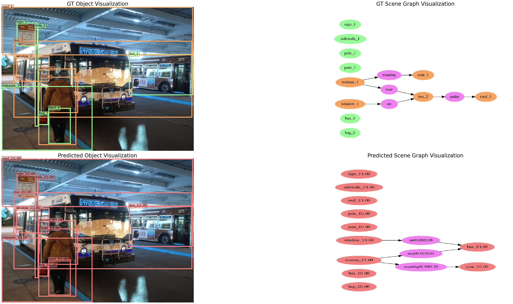

# MMSceneGraph
[](https://github.com/Kenneth-Wong/MMSceneGraph/blob/master/LICENSE)
[](https://www.python.org/)


## Introduction

MMSceneneGraph is an open source code hub for scene graph generation as well as supporting downstream tasks based on the scene graph on PyTorch. The frontend object detector is supported by [open-mmlab/mmdetection](https://github.com/open-mmlab/mmdetection). 




### Major features

- **Modular design**

  We decompose the framework into different components and one can easily construct a customized scene graph generation framework by combining different modules.

- **Support of multiple frameworks out of box**

  The toolbox directly supports popular and contemporary detection frameworks, *e.g.* Faster RCNN, Mask RCNN, etc.

- **Visualization support**
  
  The visualization of the groundtruth/predicted scene graph is integrated into the toolbox.

## License

This project is released under the [MIT license](LICENSE).

## Changelog

Please refer to [CHANGELOG.md](docs/CHANGELOG.md) for details.


## Benchmark and model zoo

The original object detection results and models provided by mmdetection are available in the [model zoo](docs/MODEL_ZOO.md). The models for the scene graph generation are
temporarily unavailable yet. 

## Supported methods and Datasets

Supported SGG (VRD) methods:

- [x] Neural Motifs (CVPR'2018)
- [x] VCTree (CVPR'2019)
- [x] TDE (CVPR'2020)
- [x] VTransE (CVPR'2017)
- [x] IMP (CVPR'2017)
- [x] KERN (CVPR'2019)
- [x] GPSNet (CVPR'2020)
- [x] HetH (ECCV'2020, ours)
- [x] TopicSG (ICCV'2021, ours)

Supported saliency object detection methods:
- [x] R3Net (IJCAI'2018)
- [x] SCRN (ICCV'2019)

Supported image captioning methods:
- [x] bottom-up (CVPR'2018)
- [x] XLAN (CVPR'2020)


Supported datasets:

- [x] Visual Genome: VG150 (CVPR'2017)
- [x] VRD (ECCV'2016)
- [x] Visual Genome: VG200/VG-KR (ours)
- [x] MSCOCO (for object detection, image caption)
- [x] RelCap (from VG and COCO, ours)


## Installation

As our project is built on mmdetection 1.x (which is a bit different from their current master version 2.x), please refer to [INSTALL.md](docs/INSTALL.md). 
If you want to use mmdetection 2.x, please
 refer to [mmdetection/get_start.md](https://github.com/open-mmlab/mmdetection/blob/master/docs/get_started.md).

## Getting Started
Please refer to [GETTING_STARTED.md](docs/GETTING_STARTED.md) for using the projects. We will update it constantly.


## Acknowledgement

We appreciate the contributors of the [mmdetection](https://github.com/open-mmlab/mmdetection) project and [Scene-Graph-Benchmark.pytorch](https://raw.githubusercontent.com/KaihuaTang/Scene-Graph-Benchmark.pytorch/master/README.md) which inspires our design. 

## Citation

If you find this code hub or our works useful in your research works, please consider citing:

```
@inproceedings{wang2021topic,
  title={Topic Scene Graph Generation by Attention Distillation from Caption},
  author={Wang, Wenbin and Wang, Ruiping and Chen, Xilin},
  booktitle={Proceedings of the IEEE/CVF International Conference on Computer Vision (ICCV)},
  pages={15900--15910},
  month = {October},
  year={2021}
}


@inproceedings{wang2020sketching,
  title={Sketching Image Gist: Human-Mimetic Hierarchical Scene Graph Generation},
  author={Wang, Wenbin and Wang, Ruiping and Shan, Shiguang and Chen, Xilin},
  booktitle={Proceedings of European Conference on Computer Vision (ECCV)},
  pages={222--239},
  year={2020},
  volume={12358},
  doi={10.1007/978-3-030-58601-0_14},
  publisher={Springer}
}

@InProceedings{Wang_2019_CVPR,
author = {Wang, Wenbin and Wang, Ruiping and Shan, Shiguang and Chen, Xilin},
title = {Exploring Context and Visual Pattern of Relationship for Scene Graph Generation},
booktitle = {Proceedings of the IEEE/CVF Conference on Computer Vision and Pattern Recognition (CVPR)},
pages = {8188-8197},
month = {June},
address = {Long Beach, California, USA},
doi = {10.1109/CVPR.2019.00838},
year = {2019}
}
```
